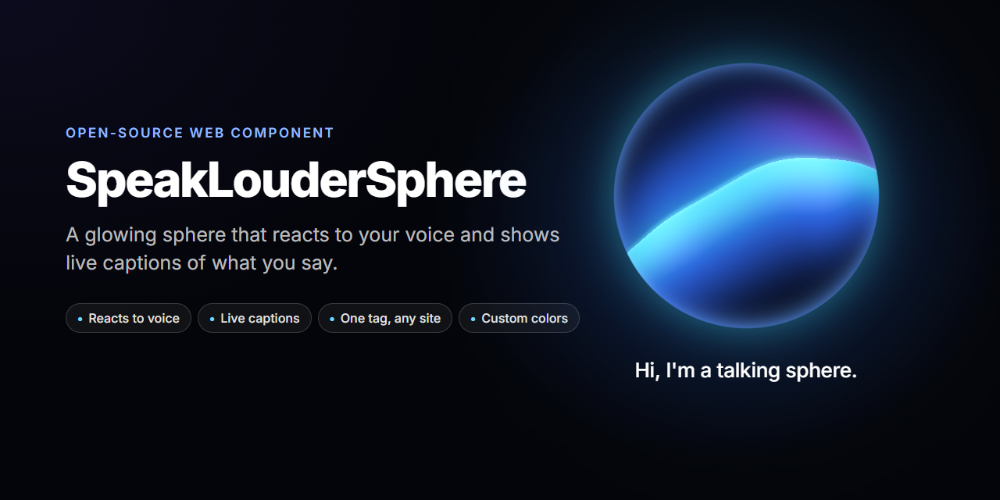
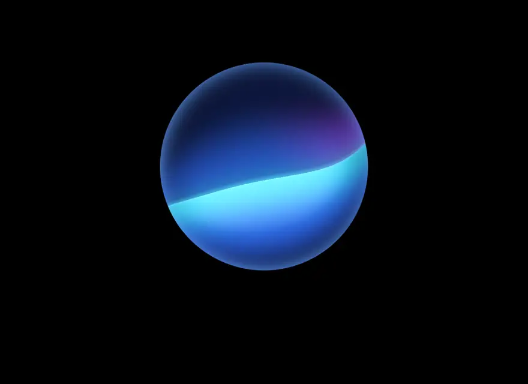

<p align="center">
  
</p>

<p align="center">
  <a href="https://speak-louder-sphere.vercel.app"><b>Live demo</b></a> ·
  <a href="docs/demo.mp4"><b>Video with sound</b></a> ·
  <a href="#quick-start"><b>Quick start</b></a>
</p>

**SpeakLouderSphere** is a glowing glass sphere for your website. It reacts to your voice in real time and shows live captions of what you say.

It is a single Web Component with no dependencies: add one `<script>` and one tag, and it works on any site.

<p align="center">
  
</p>

## Features

- **Reacts to your voice.** The louder you speak, the brighter it glows. It pulses with every syllable.
- **Live captions.** Your words appear under the sphere while you talk.
- **One tag, any website.** One small file (~14 KB gzipped). No framework, no build step. Works with plain HTML, React, Vue, WordPress, Webflow, Tilda…
- **Your colors.** 7 ready-made presets, or any CSS colors you like.
- **Scriptable.** Let it speak with your AI assistant's voice, or plug in your own speech-to-text.
- **Light on the device.** Pauses when off-screen, caps at 60 fps, respects "reduce motion".

## Quick start

Paste this anywhere in your HTML:

```html
<script src="https://cdn.jsdelivr.net/gh/Likemiens/SpeakLouderSphere@v0.1.0/dist/speak-louder-sphere.iife.js"></script>

<speak-louder-sphere text="Hi! Tap me and say something."></speak-louder-sphere>
```

Open the page, tap the sphere, allow the microphone and start talking.

> [!TIP]
> Want to pick colors visually? Open the [live demo](https://speak-louder-sphere.vercel.app), press **Customize** and copy the ready-made code.

> [!NOTE]
> Browsers only give microphone access on **HTTPS** pages (and on `localhost`). Inside an `<iframe>`, add `allow="microphone"`.

### With a bundler

```bash
npm install github:Likemiens/SpeakLouderSphere
```

```js
import 'speak-louder-sphere'; // registers <speak-louder-sphere>
```

## Options

Everything is set with HTML attributes:

| Attribute | Default | What it does |
|---|---|---|
| `lang` | page language | Speech recognition language: `en-US`, `es-ES`, `de-DE`, `ru-RU`… |
| `text` | — | Text under the sphere while the microphone is off |
| `listening-text` | — | Text while listening, before any words are heard |
| `preset` | `nova` | Color preset: `nova`, `aurora`, `amethyst`, `sunset`, `ember`, `ocean`, `mono` |
| `color-deep`, `color-body`, `color-glow`, `color-accent`, `color-rim` | from preset | Change single colors (any CSS color) |
| `size` | `320` | Sphere diameter: a number (px) or any CSS length |
| `captions` | on | `captions="false"` hides the captions (the sphere still reacts) |
| `caption-lines` | `2` | How many lines of captions to show |
| `caption-hold` | `2600` | How long a finished phrase stays on screen, in ms |
| `sensitivity` | `1` | Microphone sensitivity, from `0.1` to `5` |
| `speed` | `1` | Animation speed (`0` freezes it) |
| `quality` | `auto` | Canvas resolution: `low`, `medium`, `high` |
| `interactive` | `true` | `false`: clicking does not toggle the microphone (control it from code) |
| `simulate` | — | Fake speech while idle — handy for previews |
| `show-errors` | — | Show problems (no mic access, no speech service) as text. By default they only go to the console |

Example:

```html
<speak-louder-sphere preset="aurora" size="280" lang="es-ES" text="¡Hola! Tócame y habla."></speak-louder-sphere>
```

### Colors

Each preset is five colors. Override any of them:

| Role | Where you see it | `nova` |
|---|---|---|
| `deep` | the dark glass (keep it dark) | `#07154a` |
| `body` | the top of the glowing sheet | `#2f6bff` |
| `glow` | the bright underside and the fold | `#3fe6ff` |
| `accent` | the tint on top | `#9747ff` |
| `rim` | the edge of the glass | `#5f9dff` |

```html
<speak-louder-sphere preset="sunset" color-glow="#ffd166"></speak-louder-sphere>
```

### Caption style

Captions use your page's font and color. Tune them with CSS variables:

```css
speak-louder-sphere {
  --sls-size: 360px;              /* sphere diameter */
  --sls-gap: 48px;                /* space between the sphere and the text */
  --sls-font-family: "Inter", sans-serif;
  --sls-font-size: 24px;
  --sls-caption-color: #fff;
  --sls-interim-opacity: 0.55;    /* words that are not confirmed yet */
}
```

For full control use `::part(caption)`. Other parts: `root`, `stage`, `glow`, `canvas`, `button`.

## JavaScript API

```js
const sphere = document.querySelector('speak-louder-sphere');

await sphere.start();   // turn the microphone and captions on
sphere.stop();          // turn them off
sphere.listening;       // true while the microphone is on

sphere.setColors({ glow: '#00ffa3' });   // change colors on the fly
sphere.setCaption('Any text you like');  // show your own text
sphere.simulate(true);                   // fake speech, no microphone needed
```

**Make it speak with your assistant's voice.** Connect any `<audio>` element (for example, text-to-speech) and the sphere moves with the sound:

```js
const reply = new Audio('/reply.mp3');
sphere.connectMediaElement(reply);
sphere.setCaption('Here is what I found for you.');
reply.play();
```

Remote voices work too: `sphere.connectStream(mediaStream)`. Or drive it yourself with `sphere.setLevel(0..1)`.

**Send what the user said to your backend:**

```js
sphere.addEventListener('sls-transcript', (e) => {
  if (e.detail.final) sendToAssistant(e.detail.final);
});
```

**Use your own speech-to-text** (Whisper, Deepgram, …) and show it as captions:

```js
sphere.pushTranscript({ interim: 'hello wor' });   // live guess, may change
sphere.pushTranscript({ final: 'hello world' });   // confirmed text
```

### Events

| Event | `detail` |
|---|---|
| `sls-start` / `sls-stop` | the microphone was turned on / off |
| `sls-transcript` | `{ text, final, interim, isFinal }` — the current phrase |
| `sls-error` | `{ code, message }`, e.g. `mic-NotAllowedError`, `speech-network` |
| `sls-sourcechange` | `{ source }`: `none`, `microphone`, `stream`, `element`, `simulation`, `manual` |

## Browser support

| | Sphere and voice reaction | Live captions |
|---|---|---|
| Chrome, Edge (desktop and Android) | ✅ | ✅ |
| Safari (macOS and iOS) | ✅ | ✅ |
| Firefox | ✅ | — |

Captions use the speech recognition built into the browser (the Web Speech API). Chrome and Edge send the audio to their cloud services, so they need an internet connection. Some Chromium-based browsers don't provide this service at all.

Need captions everywhere, or offline? Connect any speech-to-text with `pushTranscript()` — the sphere and captions work the same way.

## Development

```bash
npm install
npm run dev          # demo with hot reload at http://localhost:5173
npm run build        # the widget -> dist/
npm run build:site   # demo site -> site/ (this is what Vercel deploys)
```

```
src/
  element.ts    the <speak-louder-sphere> element
  shaders.ts    the sphere (WebGL)
  audio.ts      loudness and frequencies from the microphone or any audio
  speech.ts     live speech recognition (Web Speech API)
  captions.ts   word-by-word captions
  colors.ts     presets and color parsing
demo/           the demo page with the Customize panel
examples/       embed examples
dist/           ready-to-use files
```

Every push to `main` deploys the demo to [speak-louder-sphere.vercel.app](https://speak-louder-sphere.vercel.app).

## License

[MIT](LICENSE) © Likemiens
